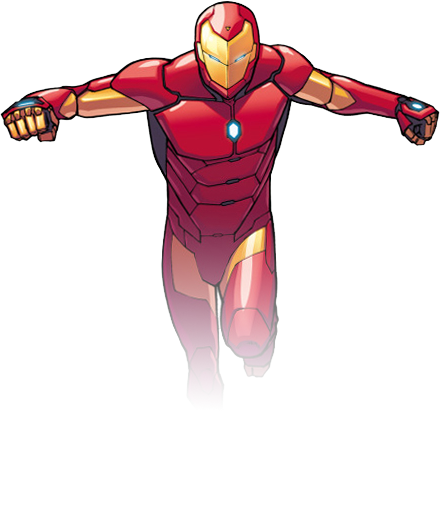

#seunggongwon.github.io

kevin test website.

-

# TODO

- [ ] Study Markdown
- [ ] make `_index.html`

```html
<!-- 비순차 목록 -->
<ul>
	<li>item1</li>
	<li>item2</li>
	<li>item3</li>
</ul>
<!-- 순차 목록 -->
<ol>
	<li>item1</li>
	<li>item2</li>
	<li>item3</li>
</ol>
```

### 비순차 목록

- item1
- item2
- item3

### 순차 목록

1. item1
1. item2
1. item3

### 이미지

```html

```


### 하이퍼링크

```html
<a href="http:iropke.com/">이롭게 에이전시</a>
```

- [[새앨범] 십센치 '텐텐절 왔다' 그들만의 색깔 살려낸 앨범 11일 자정 발매 '...](http://www.sportsq.co.kr/news/articleView.html?idxno=204140)
- ['컬투쇼' 10cm(십센치) 권정열, "디스하기엔 너무 안 유명해" 소란 고영배 맞...](http://www.newspim.com/news/view/20161010000276)
- ['컬투' 음색깡패 십센치, 쫀득쫀득한 신곡도 흥해라(종합)](http://isplus.live.joins.com/news/article/article.asp?total_id=20701947&cloc=)

### 인용구문

인용절은 보통 들여쓰기를 통해 사용자에게 일반 문장과 구분해준다.<br>
html 언어에서는 `<blockquote>` 요소를 사용하여 인용절을 구조화한다.

> "Design is ALL. ALL is Design."<br>
> "It`s delicious"<br>
> "나야 현빈"

### 표 추가

Job type | Role
---|---
Planner | Plan
Designer | Design
Developer | Develop

